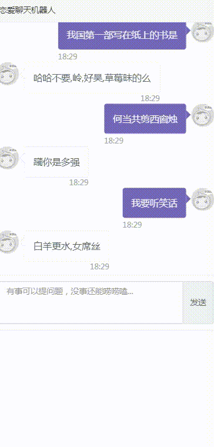
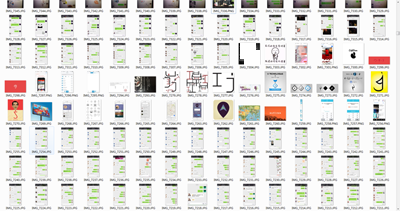

 💘💘💘恋爱聊天机器人 ，分析微信，陌陌微博等聊天记录机器学习对话，送给想恋爱的男生女生的聊天技巧

       

## 恋爱聊天机器人
 
### 介绍

 

恋爱聊天机器人,让你更懂的和男生和女生聊天，看看恋爱机器人是如何聊天的，最高效的提高你的情商。^_^哈啊哈
-测试地址<a href="https://lucky.kuaiduodian.com/love_bot/web/index.html">网页版恋爱机器人</a>
-

### 特性：
 

* 自动识别微信对话
* 自动识别陌陌对话
* 采用BestMatch算法自动对话
* 支持对话导入
* chatterbot
 

## 原理

- 网络获取一大批微信或者陌陌聊天记录或者本人的聊天记录
- 对每个聊天记录进行图像识别建立回话
- 用chatterbot对会话进行训练
- 采用HUG框架提供api接口
- 打开网页输入就可以获得答案

### 安装使用
 
--------------

 * 安装 Python 2.7 or newer 
 * 安装 chatterbot pip install chatterbot.(**chatterbot-1.0.5 比较耗时，需要比较大的内存至少1G**)
 * 安装 chatterbot_corpus pip install chatterbot_corpus
 * 安装 hug pip install hug
 * 安装CV2 pip install opencv-python
 * 安装OCR tesseract 
 * 安装  pip install bottle
 * 下载此项目然后解压.
 * 执行 hug -f loveimgdeal.py
 * 执行下面可以测试:
		
    $ 打开浏览器 输入 http://localhost:8000/get_response?user_input=Arron

 

相关的项目
----------------
 * <a href="https://github.com/tesseract-ocr/tesseract">tesseract</a>
 * <a href="https://github.com/gunthercox/ChatterBot">ChatterBot</a>
 * <a href="https://github.com/hugapi/hug">hug</a>
 * <a href="https://opencv.org/">opencv</a>
 

 ## 网络爬取了3千个对话（每晚凌晨2自动爬取5小时更新会话库)
--------------------

LICENSE and Conditions
--------------------

(This is so-called MIT/X License)

 
欢迎 Star 和 Fork ~ (∩_∩) ~

如果你有什么问题请提 Issue， 
